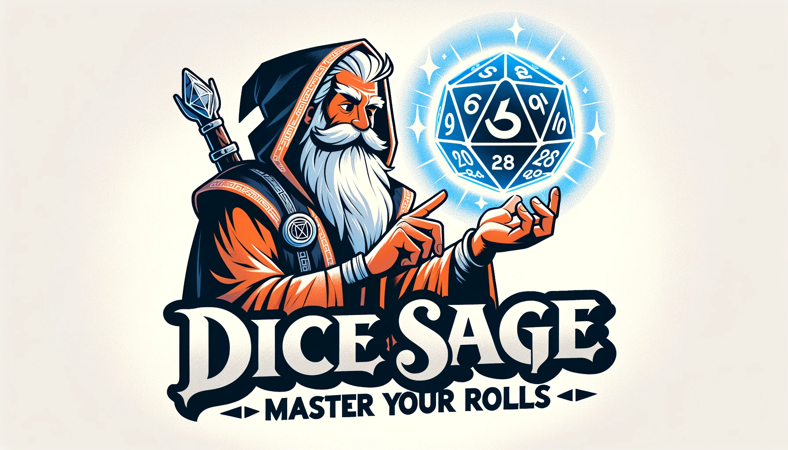

**Dice Sage** is a specialized dice-rolling application tailored for fantasy tabletop role-playing enthusiasts, especially for Dungeon Masters. It's designed to help Dungeon Masters create better-balanced encounters by simulating multiple dice rolls, giving insights into potential outcomes and assisting in scenario adjustments.

## Key Features:
- **Dice Roller**: Quickly simulate dice rolls ranging from a d4 to a d100.
- **Dice Pool**: Build a custom set of dice, simulate rolls for various combinations, and analyze the results to ensure balanced encounters.

## Demo
Explore a live demo of Dice Sage on [GitHub Pages](https://wizady.github.io/DiceSage/index.html).

## Purpose

In tabletop role-playing games, the unpredictability of dice can lead to vastly different outcomes, which might sometimes challenge Dungeon Masters in maintaining a balanced gameplay experience. Dice Sage helps by allowing the simulation of numerous dice rolls, enabling Dungeon Masters to predict potential results and tweak their encounters for optimal challenge and enjoyment.

## Usage:
1. Clone or download the repository.
2. Open `index.html` in your preferred web browser.
3. Choose either the Dice Roller or Dice Pool feature to start simulating and analyzing your rolls.

## Disclaimer:
This project was crafted using generative AI as part of a coding exploration with GenAI. It serves as an experimental playground for AI-driven development and is provided "as-is" for users.

## Contribution:
Feel free to fork, raise issues, or submit pull requests. Any feedback or contributions are welcome.

